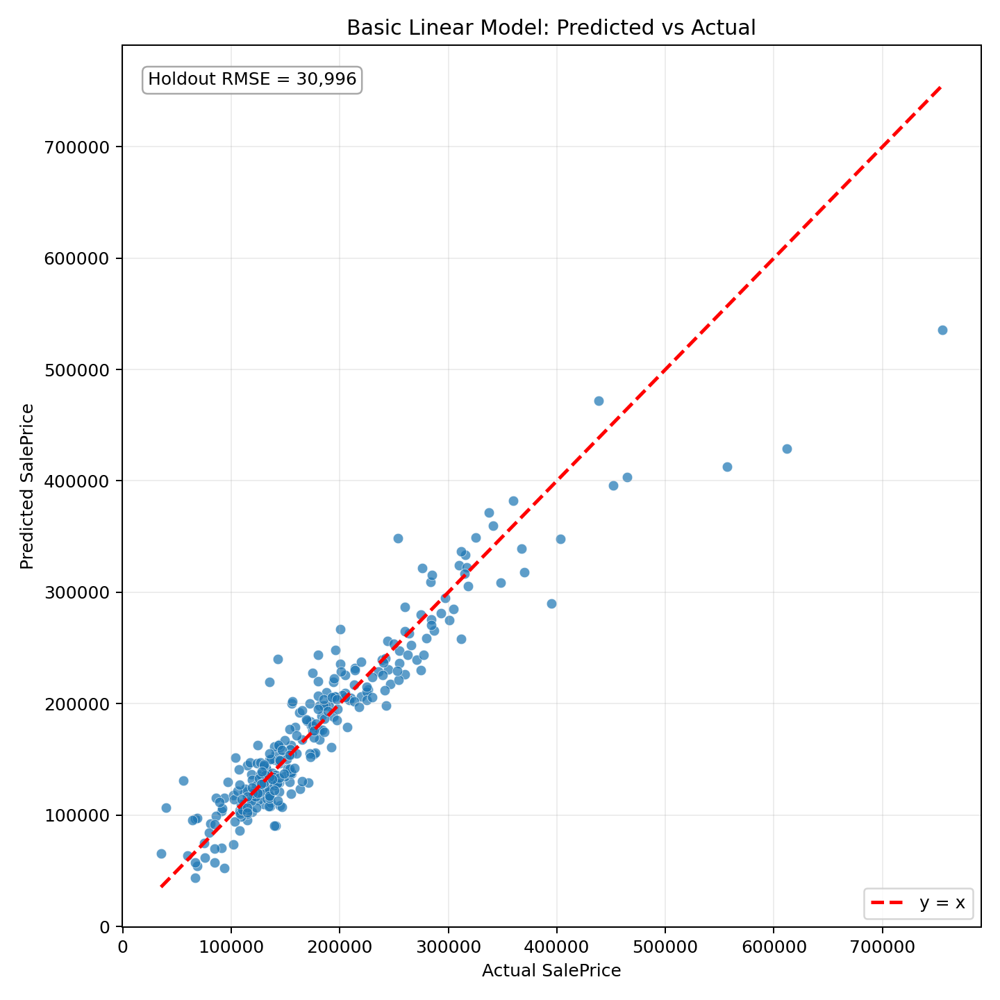

# Basic Model Report

**This basic model follows the course specification: use all available explanatory variables in a single multiple linear regression.**

## Model Specification

The housing group estimates:

```text
y_i = beta_0 + beta_X X_i + beta_D D_i + U_i
```

- Dependent variable: `SalePrice`.
- `X_i`: matrix of numerical house characteristics.
- `D_i`: matrix of dummy variables for categorical house characteristics.
- Sample split: 80% in-sample / 20% out-of-sample.
- All available variables are used: **79** raw predictors before encoding.

## 1) Coding (Core Basic Pipeline)

```python
from sklearn.compose import ColumnTransformer
from sklearn.impute import SimpleImputer
from sklearn.linear_model import LinearRegression
from sklearn.model_selection import KFold, cross_val_score, train_test_split
from sklearn.pipeline import Pipeline
from sklearn.preprocessing import OneHotEncoder

preprocessor = ColumnTransformer([
    ("num", Pipeline([
        ("imputer", SimpleImputer(strategy="median")),
    ]), numeric_cols),
    ("cat", Pipeline([
        ("imputer", SimpleImputer(strategy="most_frequent")),
        ("onehot", OneHotEncoder(handle_unknown="ignore", drop="first")),
    ]), categorical_cols),
])

model = Pipeline([
    ("preprocessor", preprocessor),
    ("linear", LinearRegression()),
])
```

## 2) Regression Equation

General form:
- SalePrice_i = beta_0 + beta_X X_i + beta_D D_i + U_i

Expanded with top 10 coefficients by absolute magnitude:

```text
SalePrice_hat = -258120.179 + 42782.755 * cat__Neighborhood_StoneBr + 41229.380 * cat__Neighborhood_NoRidge + 30686.871 * cat__LandContour_HLS + 29048.180 * cat__Neighborhood_NridgHt - 28103.831 * cat__PoolQC_Gd - 27100.056 * cat__BsmtQual_Gd - 26801.897 * cat__Condition2_PosN - 25601.093 * cat__KitchenQual_Gd + 25076.222 * cat__Exterior2nd_ImStucc - 24749.904 * cat__BsmtQual_TA
```

## 3) Regression Result

- Intercept: **-258120.179**
- Predictors before encoding: **79**
- Predictors after encoding: **242**
- Full coefficient table: `outputs/basic_model_coefficients.csv`

Top 10 coefficients by absolute magnitude:

| rank | feature | coefficient |
| --- | --- | --- |
| 1 | cat__Neighborhood_StoneBr | 42782.754705 |
| 2 | cat__Neighborhood_NoRidge | 41229.379903 |
| 3 | cat__LandContour_HLS | 30686.871366 |
| 4 | cat__Neighborhood_NridgHt | 29048.180250 |
| 5 | cat__PoolQC_Gd | -28103.831335 |
| 6 | cat__BsmtQual_Gd | -27100.056170 |
| 7 | cat__Condition2_PosN | -26801.897154 |
| 8 | cat__KitchenQual_Gd | -25601.092962 |
| 9 | cat__Exterior2nd_ImStucc | 25076.222500 |
| 10 | cat__BsmtQual_TA | -24749.904022 |

### Coefficient interpretation
- Numeric coefficients are in raw dollar units per one-unit increase in the corresponding numeric feature, holding the other included regressors fixed.
- Dummy coefficients are measured relative to the omitted baseline category because one-hot encoding uses `drop='first'`.
- These coefficients are descriptive associations in a high-dimensional linear model and should not be interpreted causally.

## 4) Graph: Predicted vs Actual



## 5) RMSE

Dollar-scale error formulas:
- RMSE = sqrt((1/n) * sum((y_i - y_hat_i)^2))
- MAE = (1/n) * sum(abs(y_i - y_hat_i))

Summary metrics:

| Metric | Value |
| --- | --- |
| holdout_rmse_dollar | 30995.62 |
| holdout_mae_dollar | 20056.14 |
| cv_rmse_dollar_mean | 34396.29 |
| cv_rmse_dollar_std | 11516.43 |
| number_of_predictors_after_encoding | 242 |

- 5-fold CV RMSE (dollar, folds): 30991.41, 28818.45, 53756.59, 34645.29, 23769.72

## Notes

- This is the basic all-variables linear specification required before any feature selection or regularization improvement.
- The Lasso report remains the improved model; this report is the full-variable baseline.
