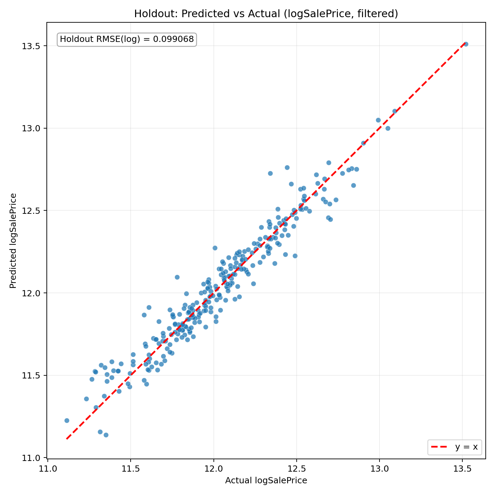

# Model Report

**Pandoc not found. HTML is generated, and Python fallback also exports PDF.**

## Model Choice

- Selected model: **filtered**
- Selection rationale: Filtered CV RMSE improved by 35.85%; choose filtered model.

## 1) Coding (Core Pipeline)

```python
from sklearn.compose import ColumnTransformer
from sklearn.impute import SimpleImputer
from sklearn.linear_model import LassoCV
from sklearn.pipeline import Pipeline
from sklearn.preprocessing import OneHotEncoder, StandardScaler

preprocessor = ColumnTransformer([
    ("num", Pipeline([
        ("imputer", SimpleImputer(strategy="median")),
        ("scaler", StandardScaler()),
    ]), numeric_cols),
    ("cat", Pipeline([
        ("imputer", SimpleImputer(strategy="most_frequent")),
        ("onehot", OneHotEncoder(handle_unknown="ignore")),
    ]), categorical_cols),
])

model = Pipeline([
    ("preprocessor", preprocessor),
    ("lasso", LassoCV(cv=5, random_state=42)),
])
```

## 2) Regression Equation

General form:
- y = log1p(SalePrice)
- y_hat = beta0 + sum(beta_j * x_j_tilde)

Expanded equation (Top10 coefficients only):

```text
y_hat = 11.858684 + 0.150255 * cat__Neighborhood_Crawfor + 0.121175 * num__GrLivArea + 0.090703 * cat__Neighborhood_StoneBr - 0.089279 * cat__MasVnrType_BrkCmn - 0.083834 * cat__Neighborhood_MeadowV - 0.077165 * cat__RoofMatl_Tar&Grv + 0.070704 * num__YearBuilt + 0.070021 * cat__Exterior1st_BrkFace + 0.069353 * num__OverallQual + 0.055265 * cat__Neighborhood_Somerst
```

Top10 absolute coefficients:

| Rank | Feature | Coefficient |
| --- | --- | --- |
| 1 | cat__Neighborhood_Crawfor | 0.150255 |
| 2 | num__GrLivArea | 0.121175 |
| 3 | cat__Neighborhood_StoneBr | 0.090703 |
| 4 | cat__MasVnrType_BrkCmn | -0.089279 |
| 5 | cat__Neighborhood_MeadowV | -0.083834 |
| 6 | cat__RoofMatl_Tar&Grv | -0.077165 |
| 7 | num__YearBuilt | 0.070704 |
| 8 | cat__Exterior1st_BrkFace | 0.070021 |
| 9 | num__OverallQual | 0.069353 |
| 10 | cat__Neighborhood_Somerst | 0.055265 |

## 3) Regression Result

- Best alpha: **0.00030808**
- Non-zero coefficients: **118**
- Top coefficients file: `outputs/top_coefficients.csv`
- CV protocol: `KFold(n_splits=5, shuffle=True, random_state=42)` with `neg_root_mean_squared_error` on log1p scale.

Top positive coefficients:

| Feature | Coefficient |
| --- | --- |
| cat__Neighborhood_Crawfor | 0.150255 |
| num__GrLivArea | 0.121175 |
| cat__Neighborhood_StoneBr | 0.090703 |
| num__YearBuilt | 0.070704 |
| cat__Exterior1st_BrkFace | 0.070021 |
| num__OverallQual | 0.069353 |
| cat__Neighborhood_Somerst | 0.055265 |
| cat__Neighborhood_BrkSide | 0.054326 |
| cat__Neighborhood_NridgHt | 0.053706 |
| cat__Functional_Typ | 0.053216 |

Top negative coefficients:

| Feature | Coefficient |
| --- | --- |
| cat__MasVnrType_BrkCmn | -0.089279 |
| cat__Neighborhood_MeadowV | -0.083834 |
| cat__RoofMatl_Tar&Grv | -0.077165 |
| cat__Neighborhood_Edwards | -0.042997 |
| cat__MSZoning_C (all) | -0.039919 |
| cat__GarageType_CarPort | -0.039398 |
| cat__SaleCondition_Abnorml | -0.038027 |
| cat__BldgType_Twnhs | -0.032616 |
| cat__Condition1_Artery | -0.029845 |
| cat__GarageQual_Fa | -0.029201 |

### Coefficient interpretation
- Numeric features use StandardScaler, so each numeric coefficient means expected change in log1p(SalePrice) for a +1 standard deviation change.
- Categorical features are one-hot encoded, so each category coefficient is interpreted relative to the omitted baseline category.
- Rare-category coefficients can be unstable; treat them as predictive signals rather than causal effects.

## 4) Graph: Predicted vs Actual



## 5) RMSE

RMSE (log1p scale) formula:
- RMSE_log = sqrt((1/n) * sum((y_i - y_hat_i)^2)), where y = log1p(SalePrice).
- This log-scale error emphasizes multiplicative/relative discrepancy.

Back-transform and dollar-scale metrics:
- SalePrice_hat = exp(y_hat) - 1
- SalePrice_true = exp(y_true) - 1
- typical_relative_error = exp(holdout_rmse_log) - 1

| Metric | Value |
| --- | --- |
| holdout_rmse_log | 0.099068 |
| cv_rmse_log_mean | 0.091781 |
| holdout_rmse_dollar | 19456.02 |
| holdout_mae_dollar | 13215.74 |
| typical_relative_error = exp(holdout_rmse_log)-1 | 0.104141 (10.41%) |

- 5-fold CV RMSE (folds): 0.097077, 0.096037, 0.089118, 0.091105, 0.085565

### Baseline vs Filtered (Sensitivity Analysis)
| Model | n_rows | holdout_rmse_log | cv_rmse_log_mean | selected |
| --- | --- | --- | --- | --- |
| Baseline | 1460 | 0.135977 | 0.143067 | No |
| Filtered (Cook's D > 4/n) | 1382 | 0.099068 | 0.091781 | Yes |
- This is a sensitivity analysis for influential points, not arbitrary deletion of data.
- A better filtered score indicates influence sensitivity; otherwise baseline is already robust.

## Appendix: Outlier Diagnostics

Cook's Distance threshold (4/n rule):
- D_i > 4/n, where n = 1460 and 4/n = **0.002740**.

Outlier impact figure:
- See `../graph/09_outlier_impact_rmse.png` for RMSE before and after removing high-influence points.
- The chart is a sensitivity check: a noticeable RMSE drop indicates a small set of influential points drives error disproportionately.
- If the change is small, model performance is relatively robust to those candidate outliers.
