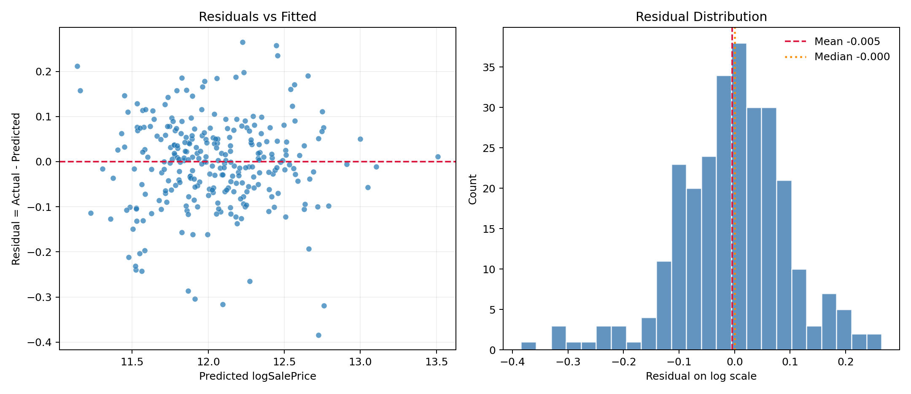

# Model Report

**Pandoc not found. HTML is generated, and Python fallback also exports PDF.**

## Executive Summary

- Final model: **filtered LassoCV** on `log1p(SalePrice)`.
- Selection rationale: Filtered CV RMSE improved by 35.85%; choose filtered model.
- Holdout RMSE(log) is **0.099068**, holdout R^2 on log scale is **0.9348**, and the implied typical relative error is about **10.41%**.
- Lasso keeps **118 of 280** encoded predictors (42.1%), which makes the final story materially easier to explain than an all-coefficient model.
- On the selected sample, `LassoCV` has the lowest CV RMSE among the tested linear model families in this report.

## 1) Why This Lasso Model Is Defensible

### Target transformation
- Raw `SalePrice` is strongly right-skewed (sample skewness **1.8829**).
- After applying `log1p(SalePrice)`, skewness drops to **0.1213**, which makes the target closer to the constant-variance, approximately symmetric setting assumed by linear models.
- Working on the log scale also makes error interpretation more business-friendly because equal vertical gaps correspond more closely to relative pricing mistakes than raw-dollar mistakes.

### Why Lasso instead of plain linear regression
- After preprocessing, the feature space expands from **79** raw predictors to **280** encoded predictors. That is large enough for multicollinearity and coefficient instability to matter.
- `LinearRegression` is a useful baseline, but it keeps every encoded column. `RidgeCV` stabilizes coefficients, but still leaves every predictor in the model. `LassoCV` both regularizes and zeroes weak predictors, so it gives the best balance of predictive performance and interpretability for this case.

| Model family | CV RMSE(log) | CV SD | Gap vs best |
| --- | --- | --- | --- |
| LassoCV | 0.091781 | 0.004805 | 0.000000 |
| RidgeCV | 0.092707 | 0.004378 | 0.000926 |
| LinearRegression | 0.100988 | 0.004814 | 0.009207 |

## 2) Data Preparation and Candidate Features

### Cleaning decisions used before modeling
- Numeric missing values tied to physical absence are filled with 0 where the dataset semantics support that choice.
- Structural categorical missing values such as basement, garage, alley, fence, pool, and masonry veneer type are mapped to explicit `None`-style levels rather than treated as random missingness.
- `LotFrontage` is filled using neighborhood medians first, then the global median, so the imputation respects local housing context.
- Remaining categorical gaps are filled with the mode, and the final model still includes downstream imputation inside the pipeline to keep train/validation behavior consistent.

### Candidate engineered features were tested, not assumed
- `TotalSF`, `HouseAge`, `RemodAge`, and `TotalBath` were evaluated because the exploratory graphs suggest they should matter.
- The final report keeps only the feature set that actually performs best under cross-validation on the selected sample.

| Feature set | Variables before encoding | CV RMSE(log) | CV SD | Decision |
| --- | --- | --- | --- | --- |
| Original cleaned features | 79 | 0.091781 | 0.004805 | Retain |
| Original + TotalSF + HouseAge + RemodAge + TotalBath | 83 | 0.091817 | 0.004715 | Tested, not retained |

- Decision: Engineered features were tested but not retained because they did not improve cross-validated RMSE.

## 3) Final Lasso Specification

### Core pipeline
```python
from sklearn.compose import ColumnTransformer
from sklearn.impute import SimpleImputer
from sklearn.linear_model import LassoCV
from sklearn.pipeline import Pipeline
from sklearn.preprocessing import OneHotEncoder, StandardScaler

preprocessor = ColumnTransformer([
    ("num", Pipeline([
        ("imputer", SimpleImputer(strategy="median")),
        ("scaler", StandardScaler()),
    ]), numeric_cols),
    ("cat", Pipeline([
        ("imputer", SimpleImputer(strategy="most_frequent")),
        ("onehot", OneHotEncoder(handle_unknown="ignore")),
    ]), categorical_cols),
])

model = Pipeline([
    ("preprocessor", preprocessor),
    ("lasso", LassoCV(cv=5, random_state=42)),
])
```

### Regression equation

General form:
- y = log1p(SalePrice)
- y_hat = beta0 + sum(beta_j * x_j_tilde)

Expanded equation (Top10 coefficients only):

```text
y_hat = 11.858684 + 0.150255 * cat__Neighborhood_Crawfor + 0.121175 * num__GrLivArea + 0.090703 * cat__Neighborhood_StoneBr - 0.089279 * cat__MasVnrType_BrkCmn - 0.083834 * cat__Neighborhood_MeadowV - 0.077165 * cat__RoofMatl_Tar&Grv + 0.070704 * num__YearBuilt + 0.070021 * cat__Exterior1st_BrkFace + 0.069353 * num__OverallQual + 0.055265 * cat__Neighborhood_Somerst
```

Top10 absolute coefficients:

| Rank | Feature | Coefficient | Approx price effect |
| --- | --- | --- | --- |
| 1 | cat__Neighborhood_Crawfor | 0.150255 | 16.21% |
| 2 | num__GrLivArea | 0.121175 | 12.88% |
| 3 | cat__Neighborhood_StoneBr | 0.090703 | 9.49% |
| 4 | cat__MasVnrType_BrkCmn | -0.089279 | -8.54% |
| 5 | cat__Neighborhood_MeadowV | -0.083834 | -8.04% |
| 6 | cat__RoofMatl_Tar&Grv | -0.077165 | -7.43% |
| 7 | num__YearBuilt | 0.070704 | 7.33% |
| 8 | cat__Exterior1st_BrkFace | 0.070021 | 7.25% |
| 9 | num__OverallQual | 0.069353 | 7.18% |
| 10 | cat__Neighborhood_Somerst | 0.055265 | 5.68% |

### What the coefficients mean in plain English
- Numeric features use `StandardScaler`, so each numeric coefficient is the expected log-price change for a +1 standard deviation shift in that variable.
- Categorical dummy coefficients are interpreted relative to the omitted baseline category for that field.
- The approximate price effects below come from `exp(coef) - 1`, so they are multiplicative interpretations on the original price scale.
- `Neighborhood = Crawfor`: relative to the omitted baseline category, predicted sale price is about 16.2% higher.
- `GrLivArea`: a +1 standard deviation increase is associated with about 12.9% higher predicted sale price.
- `Neighborhood = StoneBr`: relative to the omitted baseline category, predicted sale price is about 9.5% higher.
- `MasVnrType = BrkCmn`: relative to the omitted baseline category, predicted sale price is about 8.5% lower.
- `Neighborhood = MeadowV`: relative to the omitted baseline category, predicted sale price is about 8.0% lower.
- `RoofMatl = Tar&Grv`: relative to the omitted baseline category, predicted sale price is about 7.4% lower.

### Final fit summary

- Best alpha: **0.00030808**
- Non-zero coefficients: **118** out of **280** encoded predictors
- Top coefficients file: `outputs/top_coefficients.csv`
- CV protocol: `KFold(n_splits=5, shuffle=True, random_state=42)` with `neg_root_mean_squared_error` on log1p scale.

## 4) Validation Results

### Predicted vs actual


### Residual diagnostics


- Residual mean on the holdout split is **-0.004766**, median residual is **-0.000132**, and the residual-vs-fitted correlation is **0.005154**. Those values are close to zero, which is what we want from an unbiased linear predictor.
- The 90th percentile absolute residual on the log scale is **0.159170**, so most holdout cases sit substantially closer than the visually worst examples.

### RMSE and related metrics

RMSE (log1p scale) formula:
- RMSE_log = sqrt((1/n) * sum((y_i - y_hat_i)^2)), where y = log1p(SalePrice).
- This log-scale error emphasizes multiplicative/relative discrepancy.

Back-transform and dollar-scale metrics:
- SalePrice_hat = exp(y_hat) - 1
- SalePrice_true = exp(y_true) - 1
- typical_relative_error = exp(holdout_rmse_log) - 1

| Metric | Value |
| --- | --- |
| holdout_rmse_log | 0.099068 |
| holdout_r2_log | 0.934756 |
| cv_rmse_log_mean | 0.091781 |
| cv_rmse_log_std | 0.004805 |
| holdout_rmse_dollar | 19456.02 |
| holdout_mae_dollar | 13215.74 |
| typical_relative_error = exp(holdout_rmse_log)-1 | 0.104141 (10.41%) |

- 5-fold CV RMSE (folds): 0.097077, 0.096037, 0.089118, 0.091105, 0.085565

### Error by price band on the holdout split
- Dollar error naturally rises for more expensive homes, so the table below reports both raw-dollar MAE and percentage-style error for each holdout quartile.

| Holdout price band | n | Median actual price | MAE ($) | Mean absolute % error |
| --- | --- | --- | --- | --- |
| Q1 | 70 | 110000.00 | 10696.01 | 10.42% |
| Q2 | 70 | 146250.00 | 8773.68 | 5.86% |
| Q3 | 68 | 185750.00 | 11318.88 | 6.03% |
| Q4 | 69 | 265979.00 | 22147.78 | 7.84% |

## 5) Influence Sensitivity and Outlier Handling

### Baseline vs Filtered (Sensitivity Analysis)
| Model | n_rows | holdout_rmse_log | cv_rmse_log_mean | selected |
| --- | --- | --- | --- | --- |
| Baseline | 1460 | 0.135977 | 0.143067 | No |
| Filtered (Cook's D > 4/n) | 1382 | 0.099068 | 0.091781 | Yes |
- This is a sensitivity analysis for influential points, not arbitrary deletion of data.
- A better filtered score indicates influence sensitivity; otherwise baseline is already robust.
- In this project, the filtered specification wins clearly enough to justify using it as the presentation model while still documenting the full-data benchmark.

### Cook's distance rule used for the sensitivity screen
- D_i > 4/n, where n = 1460 and 4/n = **0.002740**.
- Influential observations flagged by this rule: **78**.

### Supporting figures
- See `../graph/08_cooks_distance.png` for the influence ranking.
- See `../graph/09_outlier_impact_rmse.png` for RMSE before and after removing high-influence points.
- The chart is a sensitivity check: a noticeable RMSE drop indicates a small set of influential points drives error disproportionately.
- If the change is small, model performance is relatively robust to those candidate outliers.

## 6) Interpretation Limits

- This is a predictive model, not a causal model. A positive coefficient means stronger association with price after controlling for the rest of the model, not proof that changing that variable alone would cause the same price change.
- Rare categories can still produce unstable coefficients even under Lasso, so the safest presentation language is predictive association rather than economic causation.
- The filtered model is justified here because the sensitivity gain is large and documented, but both the baseline and filtered results are retained in the report so the audience can see that the choice was evidence-driven rather than hidden.
